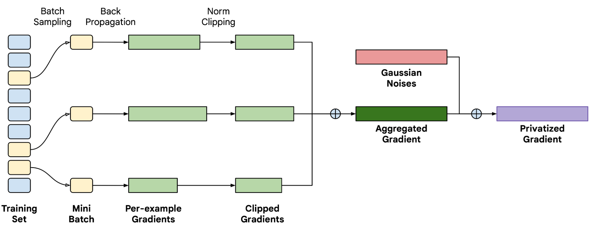

# Balancing Privacy and Performance

A Comparative Study of Gradient Clipping Techniques in DP-SGD

As privacy concerns rise in the field of deep learning, Differentially Private Stochastic Gradient Descent (DP-SGD) offers a promising approach by modifying traditional SGD to include mechanisms that safeguard user data. However, a key challenge in DP-SGD is determining the optimal gradient clipping threshold that balances privacy with model performance.

This project investigates two methods of improving DP-SGD: Automatic Clipping and Random Sparsification. I aim to evaluate how these methods impact the privacy, utility, and performance of models trained on the Duke dataset using U-Net and Nested U-Net architectures, training them with [Opacus](https://github.com/pytorch/opacus). By analyzing these approaches, the project seeks to determine optimal strategies for balancing effective learning with robust data privacy in deep learning models.

---

### Objective

Evaluate differential privacy techniques, specifically **Automatic Clipping** and **Random Sparsification**.

### Key Challenges

Determining per-example gradient clipping values which is a key algorithmic step in DP SGD to balance privacy and performance.

*An illustration of how DP-SGD works. A mini-batch of examples is sampled during each training step to compute the per-example gradients. Those gradients are processed through Clipping, aggregation and summation of Gaussian noise to produce the final privatized gradients.*

1. Choosing an appropriate clipping threshold R is crucial. A threshold that is too high may not sufficiently protect privacy, while a threshold that is too low can degrade the model's performance by excessively clipping gradients.

2. Per-sample gradient clipping requires individual gradient computation for each sample, adding significant computational burden compared to standard batch gradient computations.

3. Properly calibrating the amount of noise added after clipping is challenging and crucial for balancing privacy and model accuracy.

### Methods Analyzed

- **Automatic Clipping**: Adjusts clipping threshold dynamically for optimal learning. [Implementation](https://github.com/ParthS007/opacus/tree/course-project)
- **Random Sparsification**: Introduces randomness in gradient updates to enhance privacy. [Implementation](code/train_with_rs_opacus.py)

| Per-sample gradient clipping\Open Source Library | Opacus     |
|--------------------------------------------------|----------- |
| Automatic Clipping                               | ✅         |
| Random Sparsification                            | ✅         |

### Machine learning task

This project evaluates the Performance and Privacy of the segmentation with the convolutional neural network U-Net and Nested U-Net. The implementation uses the Opacus library for differential Privacy in PyTorch. The dataset comprises optical coherence tomography (OCT) scan of retina images.

### Models Used

- U-Net
- Nested U-Net

### Experimental Setup

#### Cases

- Training without DP
- Training with DP + Automatic Clipping
- Training with DP + Random Sparsification

#### Hyperparameters

- Batch Size: 10
- Learning Rate: 5e-4
- Number of Epochs: 100
- Weight Deacy: 1e-4

#### Opacus Specific

- Noise Multiplier: [0.3, 0.5, 0.7, 1.0]
- Target Delta: 1e-5
- Max Grad/Clipping Threshold(R): 1.0
- Clipping Mode: Per-layer

#### Random Sparsification Specific

- Final Rate(Gradual Cooling): 0.9
- Refresh Rate(Per Epoch Randomization): 2

#### Dataset

- [Duke dataset](./data/DukeData/)

### Goals

- Measure the impact of each privacy method on model utility and performance.
- Compare the privacy levels achieved by each method.
- Plot the metrics and show the performance for different noise multipliers.

### Results

**Observations**

- Nested U-Net takes more time relative to U-Net as
expected.

- In Nested U-Net, Automatic Clipping (AC) with a
Noise Multiplier (NM) of 1.0 significantly reduces training time, making it the fastest.

**Reasoning**

- Nested U-Net vs. U-Net: Nested U-Net has a more
complex architecture with additional nested layers, leading to increased computational demands and longer training times.

- AC in Nested U-Net: Automatic Clipping optimizes
gradient clipping dynamically, potentially reducing unnecessary gradient adjustments and improving computational efficiency. High efficiency is visible at a higher noise multiplier (NM 1.0), which balances noise addition and model training steps, thus reducing overall
training time.

**Observations**

- Automatic Clipping (AC) achieves a lower training
loss than Non-Differentially Private (Non-DP) training.

- Random Sparsification (RS) results in the highest training loss.

**Reasoning**

- AC vs. Non-DP: Automatic Clipping dynamically adjusts the gradient clipping threshold, optimizing the balance between Clipping and noise addition. The optimal balance reduces the impact of noise on model
training, resulting in a lower training loss than Non-DP training.

- RS with Higher Loss: Random Sparsification introduces additional randomness by dropping gradient components, which can lead to less effective gradient updates. This higher sparsification can hinder the model’s ability to converge efficiently, resulting in a higher
training loss.

**Observations**

- Automatic Clipping (AC) achieves a lower validation
loss compared to Non-Differentially Private (Non-DP)
training in U-Net, given the correct combination of
noise multiplier (NM).

- Non-DP validation loss remains lower than AC in Nested
U-Net.

**Reasoning**

- AC in U-Net: Automatic Clipping dynamically optimizes the gradient clipping threshold, effectively balancing noise and model updates. Clipping leads to better generalization and lower validation loss than Non-DP training when the NM is appropriately set.

- Non-DP in Nested U-Net: Despite the benefits of AC,
the complexity and additional parameters in Nested
U-Net may cause the noise introduced by DP mechanisms to hinder validation performance. Non-DP training avoids this issue, maintaining a lower validation loss.

**Observations**

- Privacy spent increases with the complexity of the network.

- A higher noise multiplier leads to less Privacy spent.

**Reasoning**

- Complexity and Privacy Spent: More complex networks,
such as Nested U-Net, require more detailed gradient
updates, which consume more of the privacy budget,
resulting in higher Privacy spent over iterations.

- Noise Multiplier Effect: Increasing the noise multiplier
reduces the sensitivity of gradient updates, effectively
preserving more Privacy meaning less Privacy is spent
as the noise level counteracts the detailed gradient information.

**Observations**

- Nested U-Net achieved higher validation accuracy, with
Automatic Clipping (AC) nearly matching the Non-DP performance.

- In U-Net, AC starts with higher accuracy than Non-Differentially Private (Non-DP) validation accuracy.

**Reasoning**

- Nested U-Net Performance: The complex architecture
of Nested U-Net enables better feature extraction and
segmentation, leading to higher validation accuracy.
AC’s dynamic Clipping adjusts well to this architecture, almost matching its performance.

- AC in U-Net: Automatic Clipping starts with higher
accuracy because it dynamically adjusts the clipping
threshold, optimizing gradient updates and reducing
noise impact early in training. This optimization leads
to better initial performance compared to Non-DP
training.

### Conclusion

We observed that Automatic Clipping and Random Sparsification offer distinct advantages and challenges. Automatic Clipping simplifies the tuning process by dynamically adjusting the clipping threshold, while Random Sparsification reduces the dimensionality of gradients,
potentially reducing noise requirements. Future work involves K-fold cross-validation and testing on more datasets.

#### Key takeaway

Combining AC with appropriate noise multipliers can optimize both privacy and performance across different model architectures.

#### Performance

- AC improves training efficiency, particularly in more complex models.
- AC consistently outperforms or matches Non-DP training in terms of loss and accuracy.

#### Privacy

- Higher noise multipliers preserve more privacy, but need careful tuning to balance performance.
- More complex models benefit significantly from dynamic clipping strategies, but face higher privacy costs.

### References

- Abadi, M., Chu, A., Goodfellow, I.J., McMahan, H.B., Mironov, I., Talwar, K., & Zhang, L. (2016). Deep Learning with Differential Privacy. Proceedings of the 2016 ACM SIGSAC Conference on Computer and Communications Security.

- Bu, Z., Wang, Y., Zha, S., & Karypis, G. (2022). Automatic Clipping: Differentially Private Deep Learning Made Easier and Stronger. ArXiv, abs/2206.07136.

- Zhu, J., & Blaschko, M.B. (2021). Improving Differentially Private SGD via Randomly Sparsified Gradients.

- Iwanicka, M., Sylwestrzak, M., Szkulmowska, A., & Targowski, P. (2020). Optical Coherence Tomography (OCT). Van Gogh's Sunflowers Illuminated.

- Ronneberger, O., Fischer, P., & Brox, T. (2015). U-Net: Convolutional Networks for Biomedical Image Segmentation. ArXiv, abs/1505.04597.

- Zhou, Z., Siddiquee, M.M., Tajbakhsh, N., & Liang, J. (2018). UNet++: A Nested U-Net Architecture for Medical Image Segmentation. Deep Learning in Medical Image Analysis and Multimodal Learning for Clinical Decision Support: 4th International Workshop, DLMIA 2018, and 8th International Workshop, ML-CDS 2018, held in conjunction with MICCAI 2018, Granada, Spain, S..., 11045, 3-11.

- Automatic Clipping Implementation - [Branch Link](https://github.com/ParthS007/opacus/commit/6285a3beca36408e80cfb853d052d3a26247518e)

- Altschuler, J.M., & Talwar, K. (2022). Privacy of Noisy Stochastic Gradient Descent: More Iterations without More Privacy Loss. ArXiv, abs/2205.13710.

- Yousefpour, A., Shilov, I., Sablayrolles, A., Testuggine, D., Prasad, K., Malek, M., Nguyen, J., Gosh, S., Bharadwaj, A., Zhao, J., Cormode, G., & Mironov, I. (2021). Opacus: User-Friendly Differential Privacy Library in PyTorch. ArXiv, abs/2109.12298.

---

_Feel free to create an issue if there is any discrepancy in the results and observations. :)_